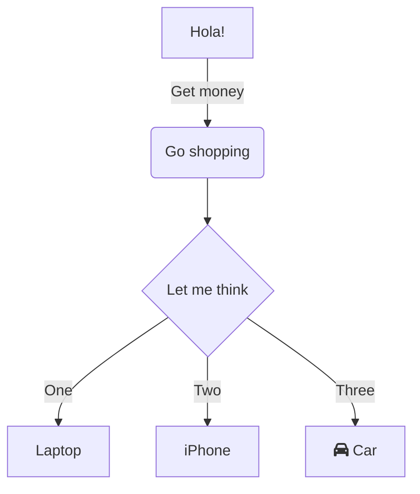

# API Rest Trello

Para utilizar el api rest de trello es necesario que tengas una cuenta en Trello: [https://trello.com/](https://trello.com/)

```mermaid
graph TD
A[Hola!] -->|Get money| B(Go shopping)
B --> C{Let me think}
C -->|One| D[Laptop]
C -->|Two| E[iPhone]
C -->|Three| F[fa:fa-car Car]
```

